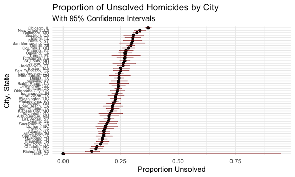

p8105_hw5_LCA2149
================
2025-11-04

# Problem 1

``` r
bday_sim = function(n_room) {
  
  birthdays = sample(1:365, n_room, replace = TRUE)

  repeated_bday = length(unique(birthdays)) < n_room

  repeated_bday
  
}

#Test the function
bday_sim(20)
```

    ## [1] TRUE

Run simulation for group sizes 2 to 50, with 10,000 iterations each.

``` r
bday_sim_results = 
  expand_grid(
    bdays = 2:50, 
    iter = 1:10000
  ) |> 
  mutate(
    result = map_lgl(bdays, bday_sim)
  ) |> 
  group_by(
    bdays
  ) |> 
  summarize(
    prob_repeat = mean(result)
  )
```

Plot the results.

``` r
bday_sim_results |> 
  ggplot(aes(x = bdays, y = prob_repeat)) + 
  geom_point(color="lightpink") + 
  geom_line(color="red") +
  labs(
    title = "Birthday Problem Simulation",
    subtitle = "Probability of at least two people sharing a birthday",
    x = "Group Size",
    y = "Probability of Shared Birthday"
  ) +
  scale_y_continuous(labels = scales::percent)
```


The birthday paradox simulation reveals that with just 23 people,
there’s over a 50% chance of shared birthdays, which contradicts most
people’s intuitive expectations. The probability rises rapidly, reaching
about 90% with 41 people and nearly 97% with 50 people, demonstrating
how quickly coincidences become likely. This highlights how human
intuition often underestimates probability when dealing with multiple
pair combinations rather than specific matches.

## Problem 2

``` r
n <- 30
sigma <- 5
mu_values <- c(0, 1, 2, 3, 4, 5, 6)

# storage
power <- numeric(7)
avg_all <- numeric(7)
avg_reject <- numeric(7)

for (j in 1:7) {
  mu <- mu_values[j]
  estimates <- numeric(5000)
  pvals <- numeric(5000)
  
  for (i in 1:5000) {
    x <- rnorm(n, mu, sigma)
    test <- t.test(x)
    estimates[i] <- test$estimate
    pvals[i] <- test$p.value
  }
  
  power[j] <- mean(pvals < 0.05)
  avg_all[j] <- mean(estimates)
  avg_reject[j] <- mean(estimates[pvals < 0.05])
}

# Plot 1
plot(mu_values, power, type = "b", xlab = "True μ", ylab = "Power")
```


There is a clear positive relationship between power and effect size. As
true effect size increases, the power grows rapidly at risk and then
starts to approach 1.

``` r
# Plot 2  
plot(mu_values, avg_all, type = "b", col = "blue", 
     xlab = "True μ", ylab = "Average Estimate")
lines(mu_values, avg_reject, type = "b", col = "red")
legend("topleft", c("All tests", "Rejected only"), col = c("blue", "red"), lty = 1)
```


The average estimate from rejected tests is only approximately equal to
the true μ for larger effect sizes (4-6), but is biased upward for
smaller effect sizes (0-3). This happens because when the true effect is
small, we only reject the null hypothesis in samples where the random
variation exaggerates the effect size. For larger true effects (μ=4-6),
this bias disappears because the test has high power and rejects the
null for nearly all samples, not just the extreme ones.

## Problem 3

``` r
homicide_data <- read.csv("homicide-data.csv")
```

The homicide dataset includes information on homicides in 50 large US
cities (including Atlanta, Houston, LA, Philly, etc). The dataset
includes uid, reported date, victim full name, race, age, and sex, city,
state, lat, long, and the disposition (case status). The raw dataset
includes these 12 variables and 52,179 cases.

``` r
# Create city_state variable

homicide_data =
  homicide_data |>
  mutate(
    city_state = str_c(city, ", ", state)
  )
```

``` r
# Summarize within cities
city_summary<-homicide_data |>
  group_by(city_state) |>
  summarise(
    total_homicides = n(),
    unsolved_homicides = sum(disposition == c("Closed without arrest", "Open/No arrest")))
```

    ## Warning: There were 26 warnings in `summarise()`.
    ## The first warning was:
    ## ℹ In argument: `unsolved_homicides = sum(disposition == c("Closed without
    ##   arrest", "Open/No arrest"))`.
    ## ℹ In group 2: `city_state = "Atlanta, GA"`.
    ## Caused by warning in `disposition == c("Closed without arrest", "Open/No arrest")`:
    ## ! longer object length is not a multiple of shorter object length
    ## ℹ Run `dplyr::last_dplyr_warnings()` to see the 25 remaining warnings.

``` r
kable(city_summary)
```

| city_state         | total_homicides | unsolved_homicides |
|:-------------------|----------------:|-------------------:|
| Albuquerque, NM    |             378 |                 75 |
| Atlanta, GA        |             973 |                172 |
| Baltimore, MD      |            2827 |                906 |
| Baton Rouge, LA    |             424 |                102 |
| Birmingham, AL     |             800 |                192 |
| Boston, MA         |             614 |                154 |
| Buffalo, NY        |             521 |                157 |
| Charlotte, NC      |             687 |                101 |
| Chicago, IL        |            5535 |               2046 |
| Cincinnati, OH     |             694 |                151 |
| Columbus, OH       |            1084 |                308 |
| Dallas, TX         |            1567 |                381 |
| Denver, CO         |             312 |                 82 |
| Detroit, MI        |            2519 |                739 |
| Durham, NC         |             276 |                 51 |
| Fort Worth, TX     |             549 |                125 |
| Fresno, CA         |             487 |                 88 |
| Houston, TX        |            2942 |                705 |
| Indianapolis, IN   |            1322 |                309 |
| Jacksonville, FL   |            1168 |                305 |
| Kansas City, MO    |            1190 |                251 |
| Las Vegas, NV      |            1381 |                274 |
| Long Beach, CA     |             378 |                 81 |
| Los Angeles, CA    |            2257 |                551 |
| Louisville, KY     |             576 |                139 |
| Memphis, TN        |            1514 |                259 |
| Miami, FL          |             744 |                225 |
| Milwaukee, wI      |            1115 |                197 |
| Minneapolis, MN    |             366 |                 89 |
| Nashville, TN      |             767 |                130 |
| New Orleans, LA    |            1434 |                479 |
| New York, NY       |             627 |                102 |
| Oakland, CA        |             947 |                255 |
| Oklahoma City, OK  |             672 |                158 |
| Omaha, NE          |             409 |                 80 |
| Philadelphia, PA   |            3037 |                684 |
| Phoenix, AZ        |             914 |                250 |
| Pittsburgh, PA     |             631 |                169 |
| Richmond, VA       |             429 |                 53 |
| Sacramento, CA     |             376 |                 71 |
| San Antonio, TX    |             833 |                178 |
| San Bernardino, CA |             275 |                 82 |
| San Diego, CA      |             461 |                 81 |
| San Francisco, CA  |             663 |                166 |
| Savannah, GA       |             246 |                 50 |
| St. Louis, MO      |            1677 |                449 |
| Stockton, CA       |             444 |                136 |
| Tampa, FL          |             208 |                 56 |
| Tulsa, AL          |               1 |                  0 |
| Tulsa, OK          |             583 |                 83 |
| Washington, DC     |            1345 |                306 |

``` r
# Baltimore, MD specific
baltimore_results <- homicide_data |>
  filter(city_state == "Baltimore, MD") |>
  summarise(
    total_homicides = n(),
    unsolved_homicides = sum(disposition == c("Closed without arrest", "Open/No arrest"))
    )|>
{function(x) prop.test(x$unsolved, x$total)}() |>
  broom::tidy() |>
  select(estimate, conf.low, conf.high)
```

    ## Warning: There was 1 warning in `summarise()`.
    ## ℹ In argument: `unsolved_homicides = sum(disposition == c("Closed without
    ##   arrest", "Open/No arrest"))`.
    ## Caused by warning in `disposition == c("Closed without arrest", "Open/No arrest")`:
    ## ! longer object length is not a multiple of shorter object length

``` r
baltimore_results
```

    ## # A tibble: 1 × 3
    ##   estimate conf.low conf.high
    ##      <dbl>    <dbl>     <dbl>
    ## 1    0.320    0.303     0.338

The proportion of homicides that are unsolved in Baltimore, MD is 32.0%
(95% CI: 30.3-33.8).

``` r
# All cities
city_proportions <- homicide_data |>
  group_by(city_state) |>
  summarize(
        total_homicides = n(),
    unsolved_homicides = sum(disposition == c("Closed without arrest", "Open/No arrest"))
    )|>
  mutate(
    test_results = map2(unsolved_homicides, total_homicides, 
                       ~prop.test(.x, .y) |> broom::tidy())
  ) |>
  unnest(test_results) |>
  select(city_state, unsolved_homicides, total_homicides, estimate, conf.low, conf.high)
```

    ## Warning: There were 26 warnings in `summarize()`.
    ## The first warning was:
    ## ℹ In argument: `unsolved_homicides = sum(disposition == c("Closed without
    ##   arrest", "Open/No arrest"))`.
    ## ℹ In group 2: `city_state = "Atlanta, GA"`.
    ## Caused by warning in `disposition == c("Closed without arrest", "Open/No arrest")`:
    ## ! longer object length is not a multiple of shorter object length
    ## ℹ Run `dplyr::last_dplyr_warnings()` to see the 25 remaining warnings.

    ## Warning: There was 1 warning in `mutate()`.
    ## ℹ In argument: `test_results = map2(...)`.
    ## Caused by warning in `prop.test()`:
    ## ! Chi-squared approximation may be incorrect

``` r
# Create plot
city_proportions |>
  mutate(city_state = fct_reorder(city_state, estimate)) |>
  ggplot(aes(x=estimate, y=city_state)) +
           geom_point() +
           geom_errorbar(aes(xmin=conf.low, xmax=conf.high), width = 0.2, color = "darkred", alpha=0.7) +
           labs(
    title = "Proportion of Unsolved Homicides by City",
    subtitle = "With 95% Confidence Intervals",
    x = "Proportion Unsolved",
    y = "City, State") +
  theme(axis.text.y = element_text(size = 6))
```


