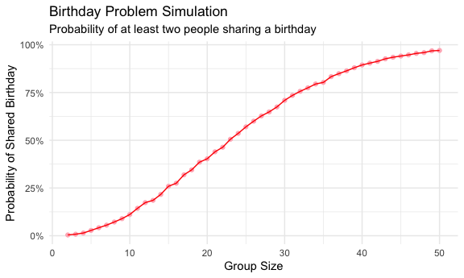
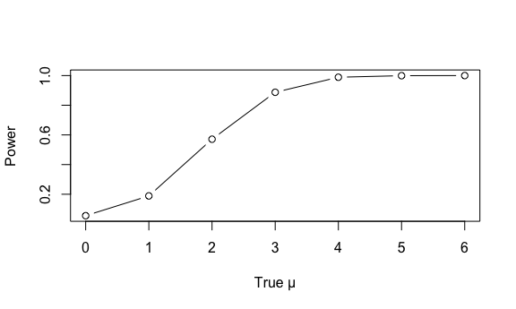
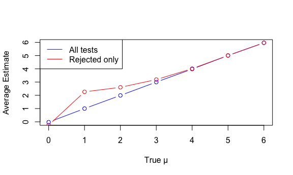

p8105_hw5_LCA2149
================
2025-11-04

# Problem 1

``` r
bday_sim = function(n_room) {
  
  birthdays = sample(1:365, n_room, replace = TRUE)

  repeated_bday = length(unique(birthdays)) < n_room

  repeated_bday
  
}

#Test the function
bday_sim(20)
```

    ## [1] FALSE

Run simulation for group sizes 2 to 50, with 10,000 iterations each.

``` r
bday_sim_results = 
  expand_grid(
    bdays = 2:50, 
    iter = 1:10000
  ) |> 
  mutate(
    result = map_lgl(bdays, bday_sim)
  ) |> 
  group_by(
    bdays
  ) |> 
  summarize(
    prob_repeat = mean(result)
  )
```

Plot the results.

``` r
bday_sim_results |> 
  ggplot(aes(x = bdays, y = prob_repeat)) + 
  geom_point(color="lightpink") + 
  geom_line(color="red") +
  labs(
    title = "Birthday Problem Simulation",
    subtitle = "Probability of at least two people sharing a birthday",
    x = "Group Size",
    y = "Probability of Shared Birthday"
  ) +
  scale_y_continuous(labels = scales::percent)
```



The birthday paradox simulation reveals that with just 23 people,
there’s over a 50% chance of shared birthdays, which contradicts most
people’s intuitive expectations. The probability rises rapidly, reaching
about 90% with 41 people and nearly 97% with 50 people, demonstrating
how quickly coincidences become likely. This highlights how human
intuition often underestimates probability when dealing with multiple
pair combinations rather than specific matches.

## Problem 2

``` r
n <- 30
sigma <- 5
mu_values <- c(0, 1, 2, 3, 4, 5, 6)

# Simple storage
power <- numeric(7)
avg_all <- numeric(7)
avg_reject <- numeric(7)

for (j in 1:7) {
  mu <- mu_values[j]
  estimates <- numeric(5000)
  pvals <- numeric(5000)
  
  for (i in 1:5000) {
    x <- rnorm(n, mu, sigma)
    test <- t.test(x)
    estimates[i] <- test$estimate
    pvals[i] <- test$p.value
  }
  
  power[j] <- mean(pvals < 0.05)
  avg_all[j] <- mean(estimates)
  avg_reject[j] <- mean(estimates[pvals < 0.05])
}

# Plot 1
plot(mu_values, power, type = "b", xlab = "True μ", ylab = "Power")
```



As seen in plot 1, there is a clear positive relationship between power
and effect size. As true effect size increases, the power grows rapidly
at risk and then starts to approach 1.

``` r
# Plot 2  
plot(mu_values, avg_all, type = "b", col = "blue", 
     xlab = "True μ", ylab = "Average Estimate")
lines(mu_values, avg_reject, type = "b", col = "red")
legend("topleft", c("All tests", "Rejected only"), col = c("blue", "red"), lty = 1)
```



The average estimate from rejected tests is only approximately equal to
the true μ for larger effect sizes (4-6), but is biased upward for
smaller effect sizes (0-3). This happens because when the true effect is
small, we only reject the null hypothesis in samples where the random
variation exaggerates the effect size. For larger true effects (μ=4-6),
this bias disappears because the test has high power and rejects the
null for nearly all samples, not just the extreme ones.

## Problem 3
